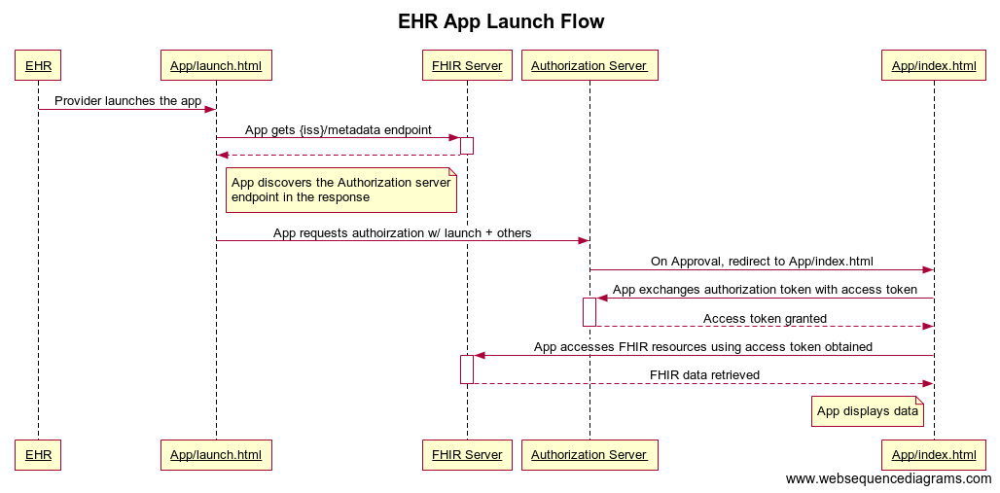
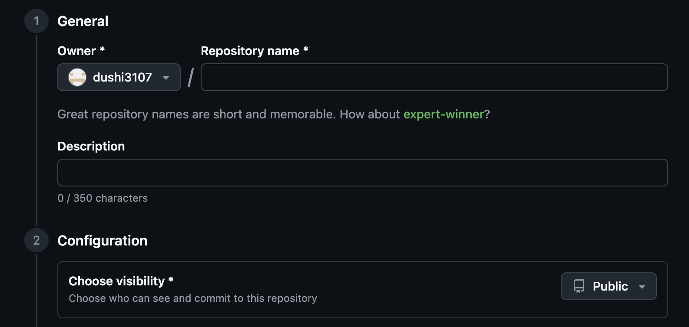
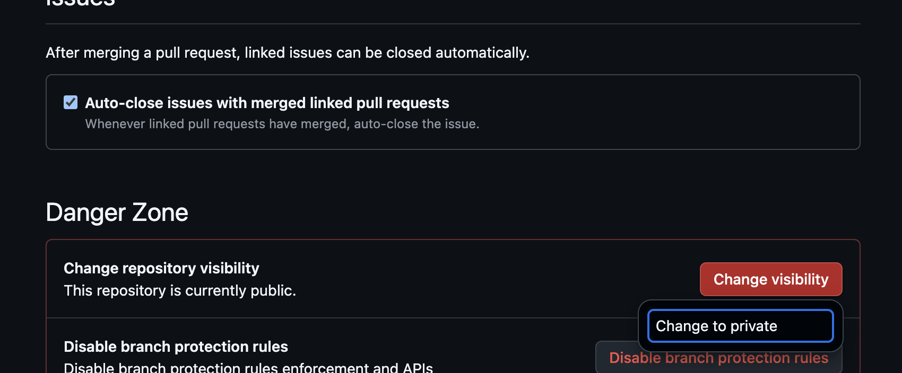
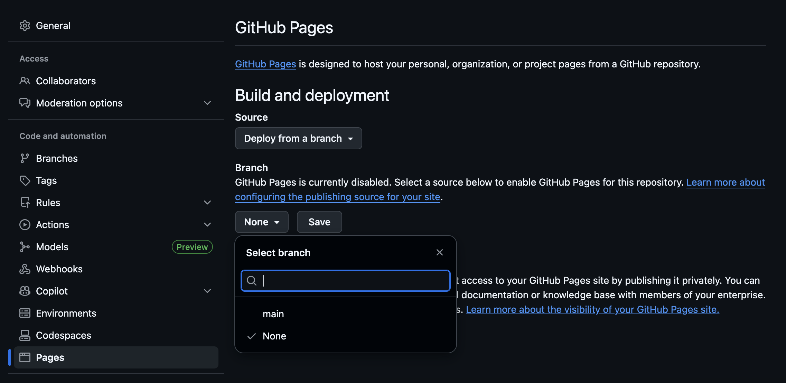
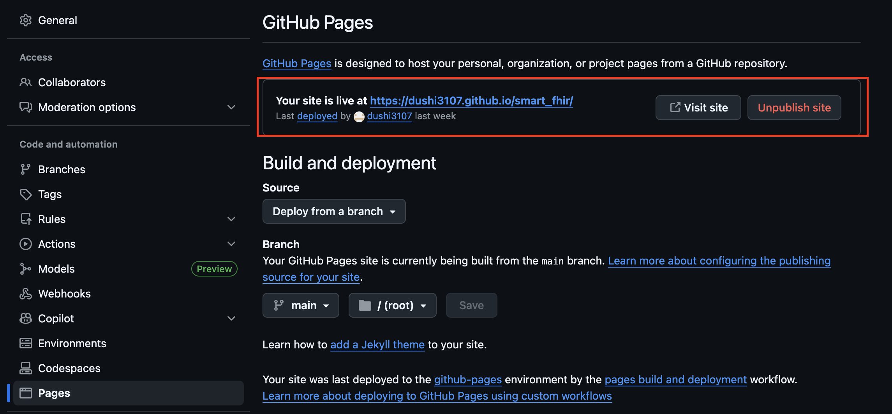
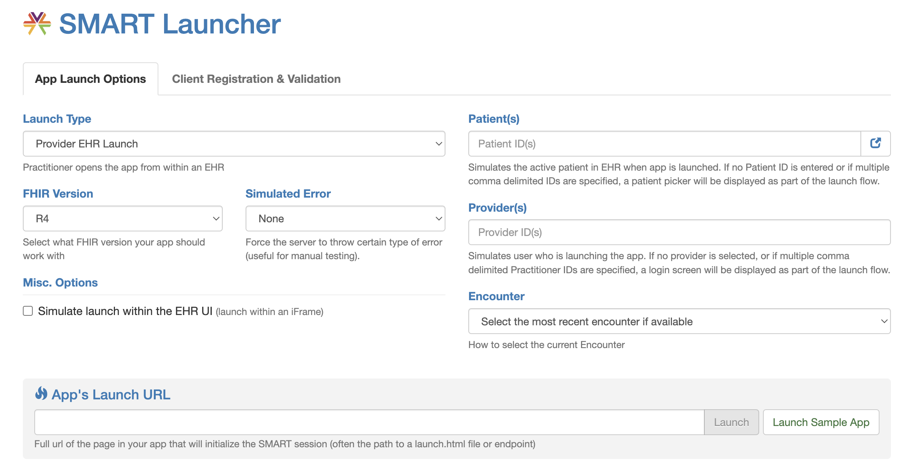
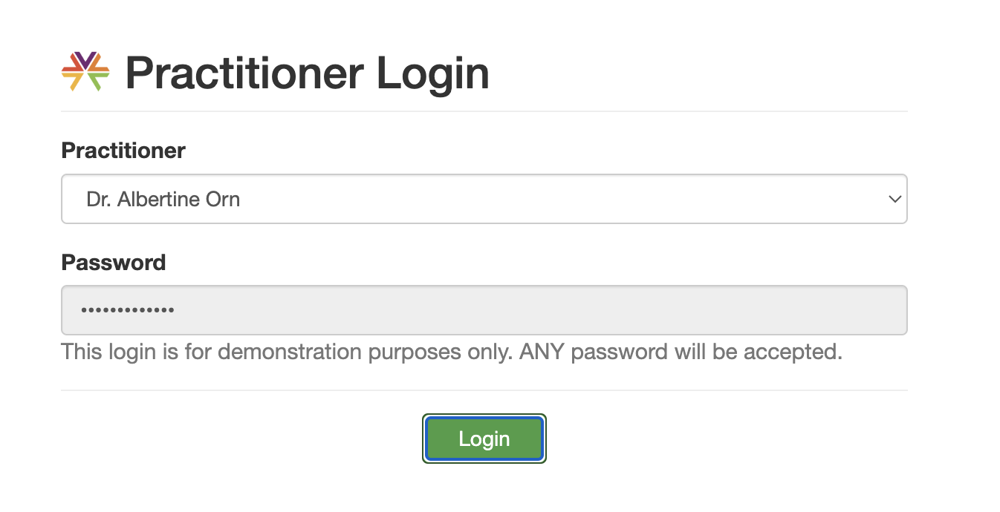
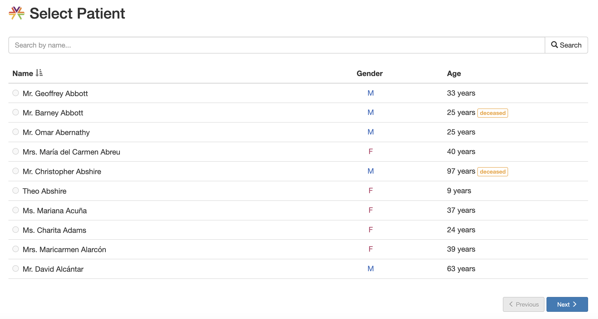
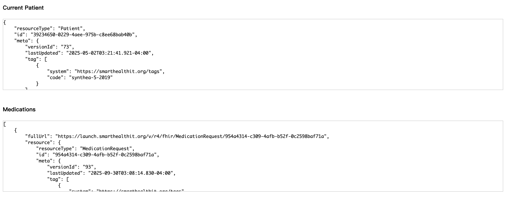

# smart_fhir
此專案展示如何建置一個Javascript APP (前端小應用)  
源於 衛福部的工作坊 "臺灣50優良SMART on FHIR 應用程式徵案" 的教學  
SMART的全稱Substitutable Medical Applications and Reusable Technologies 是可替代醫療應用程式與可重複使用技術

專案會使用到SMART Launcher 將專案部署到官方提供我們的虛擬環境，模擬我們正在EHR系統內，並開始模擬實際的應用  


### 官方教學與SMART Launcher
https://docs.smarthealthit.org/tutorials/javascript/  
https://launch.smarthealthit.org/
### 相關參考網址
https://engineering.cerner.com/smart-on-fhir-tutorial/
https://build.fhir.org/ig/HL7/smart-app-launch/app-launch.html

### 前置作業
* 此專案的 github repository (權限需設定為public)
* vscode 或其他文字編輯器

### 架構與步驟說明

圖1. 課程流程架構參考



一、架構與概念
1. 如圖所示對照官方參考網址，分成兩部分，**驗證/授權虛擬頁面**以及**實際的資料應用展示頁面**，教學中的`launch.html`與`index.html`
2. FHIR Server中每個獨立的應用(服務)都需要進行身份與權限的驗證，實作上不合法的請求根據狀態的不同回覆不同的HTTP狀態碼：  
401 Unauthorized  
403 Forbidden  
404 Not Found  
並且不回應任何資訊
3. 此範例專案的驗證功能已包成全域的js方法，只需要帶入適當的參數與欲重新導向的應用即可
    ```
    FHIR.oauth2.authorize({ param... })
    ```
4. 官方的範例部署完成後會先從登入頁面輸入帳密開始，在輸入完畢之後導向病人清單頁面，選擇病人就能檢視詳細資料

二、建置流程說明
1. 建立github專案並設定為公開專案

或事後在Settings/General內更改


2. 複製並創建網頁中的`launch.html`/`index.html`程式碼於專案內
    > launch.html
    ```html
    <!DOCTYPE html>
    <html>
        <head>
            <meta charset="UTF-8" />
            <title>Launch My APP</title>
            <script src="https://cdn.jsdelivr.net/npm/fhirclient/build/fhir-client.js"></script>
        </head>
        <body>
            <script>
                FHIR.oauth2.authorize({

                // The client_id that you should have obtained after registering a client at
                // the EHR.
                clientId: "my_web_app",

                // The scopes that you request from the EHR. In this case we want to:
                // launch            - Get the launch context
                // openid & fhirUser - Get the current user
                // patient/*.read    - Read patient data
                scope: "launch openid fhirUser patient/*.read",

                // Typically, if your redirectUri points to the root of the current directory
                // (where the launchUri is), you can omit this option because the default value is
                // ".". However, some servers do not support directory indexes so "." and "./"
                // will not automatically map to the "index.html" file in that directory.
                redirectUri: "index.html"
                });
            </script>
        </body>
    </html>
    ```
    `index.html`
    ```html
    <!DOCTYPE html>
    <html lang="en">
        <head>
            <meta charset="UTF-8" />
            <title>Example SMART App</title>
            <script src="https://cdn.jsdelivr.net/npm/fhirclient/build/fhir-client.js"></script>
            <style>
                #patient, #meds {
                    font-family: Monaco, monospace;
                    white-space: pre;
                    font-size: 13px;
                    height: 30vh;
                    overflow: scroll;
                    border: 1px solid #CCC;
                }
            </style>
        </head>
        <body>
            <h4>Current Patient</h4>
            <div id="patient">Loading...</div>
            <br/>
            <h4>Medications</h4>
            <div id="meds">Loading...</div>
            <script type="text/javascript">
                FHIR.oauth2.ready().then(function(client) {
                    
                    // Render the current patient (or any error)
                    client.patient.read().then(
                        function(pt) {
                            document.getElementById("patient").innerText = JSON.stringify(pt, null, 4);
                        },
                        function(error) {
                            document.getElementById("patient").innerText = error.stack;
                        }
                    );
                    
                    // Get MedicationRequests for the selected patient
                    client.request("/MedicationRequest?patient=" + client.patient.id, {
                        resolveReferences: [ "medicationReference" ],
                        graph: true
                    })
                    
                    // Reject if no MedicationRequests are found
                    .then(function(data) {
                        if (!data.entry || !data.entry.length) {
                            throw new Error("No medications found for the selected patient");
                        }
                        return data.entry;
                    })
                    

                    // Render the current patient's medications (or any error)
                    .then(
                        function(meds) {
                            document.getElementById("meds").innerText = JSON.stringify(meds, null, 4);
                        },
                        function(error) {
                            document.getElementById("meds").innerText = error.stack;
                        }
                    );

                }).catch(console.error);
            </script>
        </body>
    </html>
    ```
3. 把這些更改提交推送到github上
4. 接著需要把頁面交給github託管，模擬對外的應用APP，至專案Settings/Pages選擇branch後Save

等待幾分鐘後會出現代管的連結網址 https://dushi3107.github.io/smart_fhir/

5. 將此網址後面加上launch.html -> 
https://dushi3107.github.io/smart_fhir/launch.html 貼到SMART Launcher網頁上的Launch URL欄位中，並按下Launch

就會導向登入頁面

按下登入後即出現病人清單

點選病人可以檢視詳細資料

